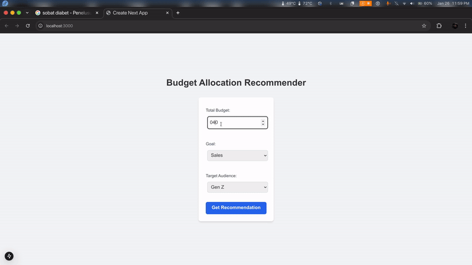

# Marketing-Sniper
A web-based ad spend allocation tool for optimizing marketing budgets.

## Features
- Input budget and platforms.
- Calculate budget allocation.
- Simple, responsive design with Tailwind CSS.

## Tech Stack
- **Frontend**: React, Tailwind CSS
- **Backend**: Flask

## App Overview
Marketing-Sniper is a web-based ad spend allocation tool designed to optimize marketing budgets. Users can input their total budget, select goals, and target audiences, and the app provides data-driven recommendations for budget distribution across various categories.

## Machine Learning Approach
The Marketing-Sniper app employs a machine learning model trained on historical budget allocation data sourced from [Hugging Face's Marketing Social Media Dataset](https://huggingface.co/datasets/RafaM97/marketing_social_media). The model uses the following input features:
- **Total Budget**: The overall budget available for allocation.
- **Goal**: The marketing objective (e.g., brand awareness, lead generation).
- **Target Audience**: The demographic or segment the marketing efforts are aimed at.

The model processes this input data to predict optimal budget allocations across various categories, such as Ads Budget, Influencer Budget, and Content Budget. By leveraging this data-driven approach, the app provides users with informed recommendations for their marketing spend.

## How the Model is Built
The machine learning model used in Marketing-Sniper is a Random Forest Regressor trained on preprocessed data. Below is an outline of the model-building process:

1. **Load and Preprocess Data**:
   - The dataset is loaded from `scaled_budget_data.csv`.
   - Input features include `Total Budget`, `Goal`, and `Target Audience`, while the target variables are `Ads Budget`, `Influencer Budget`, and `Content Budget`.
   - Categorical variables (`Goal` and `Target Audience`) are one-hot encoded.
   - Encoded features are combined with numeric features (`Total Budget`) to create a preprocessed dataset.

2. **Train-Test Split**:
   - The preprocessed data is split into training and testing sets (80% train, 20% test).

3. **Model Training**:
   - A Random Forest Regressor is trained using the training set.

4. **Model Evaluation**:
   - The model's performance is evaluated using Mean Absolute Error (MAE) on the test set.

5. **Prediction Function**:
   - A function, `predict_budget`, is defined to preprocess new input data and predict budget allocations for `Ads Budget`, `Influencer Budget`, and `Content Budget`.

### Code Implementation
```python
import pandas as pd
from sklearn.model_selection import train_test_split
from sklearn.preprocessing import OneHotEncoder
from sklearn.ensemble import RandomForestRegressor
from sklearn.metrics import mean_absolute_error
import joblib

# Load the dataset
data = pd.read_csv("scaled_budget_data.csv")

# Preprocess the data
# Extract input features and target variables
X = data[['Total Budget', 'Goal', 'Target Audience']]
y = data[['Ads Budget', 'Influencer Budget', 'Content Budget']]

# One-hot encode categorical variables
encoder = OneHotEncoder(sparse_output=False)
encoded_features = encoder.fit_transform(X[['Goal', 'Target Audience']])

# Combine encoded features with numeric ones
X_preprocessed = pd.concat(
    [
        pd.DataFrame(X[['Total Budget']].values, columns=['Total Budget']),
        pd.DataFrame(encoded_features, columns=encoder.get_feature_names_out(['Goal', 'Target Audience']))
    ],
    axis=1
)

# Ensure column names are strings
X_preprocessed.columns = X_preprocessed.columns.astype(str)

# Split data into training and testing sets
X_train, X_test, y_train, y_test = train_test_split(X_preprocessed, y, test_size=0.2, random_state=42)

# Train a Random Forest Regressor
model = RandomForestRegressor(random_state=42)
model.fit(X_train, y_train)

# Evaluate the model
y_pred = model.predict(X_test)
mae = mean_absolute_error(y_test, y_pred)
print(f"Mean Absolute Error: {mae}")

# Define a function to predict budget allocation for a new input
def predict_budget(total_budget, goal, target_audience):
    # Prepare the input
    input_data = pd.DataFrame([[total_budget, goal, target_audience]], columns=['Total Budget', 'Goal', 'Target Audience'])
    encoded_input = encoder.transform(input_data[['Goal', 'Target Audience']])
    
    input_preprocessed = pd.concat(
        [
            pd.DataFrame(input_data[['Total Budget']].values, columns=['Total Budget']),
            pd.DataFrame(encoded_input, columns=encoder.get_feature_names_out(['Goal', 'Target Audience']))
        ],
        axis=1
    )
    
    # Ensure feature names match the model's training data
    input_preprocessed.columns = input_preprocessed.columns.astype(str)
    input_preprocessed = input_preprocessed.reindex(columns=X_preprocessed.columns, fill_value=0)
    
    # Make a prediction
    prediction = model.predict(input_preprocessed)
    return prediction

# Example usage
new_prediction = predict_budget(4000.0, "Increase Traffic", "Public")
print("Predicted budget allocation (Ads, Influencer, Content):", new_prediction)
```

## App Flow
1. Users input their total budget, goal, and target audience through the frontend interface.
2. The frontend sends this data to the backend via a POST request to the `/recommend` endpoint.
3. The backend processes the input, prepares it for the model, and makes predictions using the loaded machine learning model.
4. The predicted budget allocations are returned to the frontend, where they are visualized in a bar chart.

## Running the App Locally
### Backend
1. Navigate to the `backend/` directory.
2. Create a virtual environment:
   ```bash
   python3 -m venv venv
   source venv/bin/activate
   ```
3. Install dependencies:
   ```bash
   pip install -r requirements.txt
   ```
4. Run the server:
   ```bash
   python app.py
   ```

### Frontend
1. Navigate to the `frontend/` directory.
2. Start the development server:
   ```bash
   npm start
   ```

## Video Overview



Click on the image above to watch the video demo of Marketing-Sniper.

## Credits
- Dataset: [Hugging Face - Marketing Social Media Dataset](https://huggingface.co/datasets/RafaM97/marketing_social_media)

